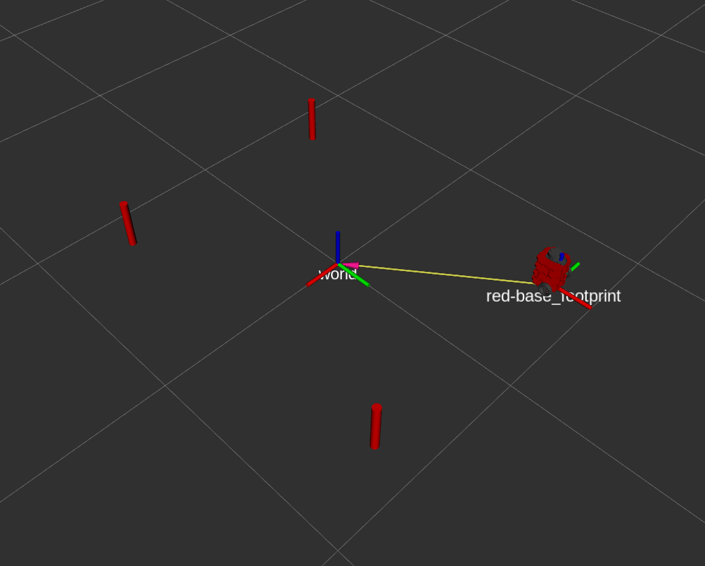

# nusim ROS package

### Brief overview 
A package to simulate and visulize the robot and obstacles in Rviz. The package also contains functionalities to teleport and rest the position of the robot.
### Launch files
* A launch file `load.launch` from **nuturtle_description** package is included. Both `use_jsp` and `use_rviz` are set to false, and `color` is set to red
* A `Rviz` node is launched with `nusim.rviz` configuration
* A `basic_world.yaml` file is loaded to the parameter server
* A `nusim` node simulates and visulizes the robot
### Parameters
* All configurable parameters are stored in `basic_world.yaml`
* **x0**: initial x-coordinate of the robot
* **y0**: initial y-coordinate of the robot
* **theta0**: initial theta of the robot
* **cylinder_xs**: list of x-coordinates of the cylinders
* **cylinder_ys**: list of y-coordinates of the cylinders
* **cylinder_r**: radius of the cylinder
* **cylinder_h**: height of the cylinder
### Rviz screenshot

