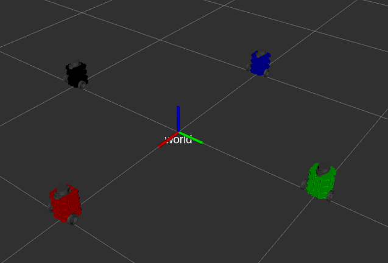

# Nuturtle  Description
URDF files for Nuturtle `urdf/turtlebot3_burger.urdf.xacro`
* `roslaunch nuturtle_description load.launch use_jsp:=true color:=black` to see the robot in rviz.
* `roslaunch nuturtle_description load_all.launch` to see three copies of the robot in rviz.  
